<div align="center">
  
</div>

<div align="center">
  
</div>


---

## 🚀 About Me


```javascript
const ardhish = {
    name: "Ardhish Patel",
    role: "Electronics & Communication Engineering Student",
    location: "🏛️ IIIT Nagpur, India",
    year: "3rd Year B.Tech",
    
    currentFocus: [
        "🔬 VLSI Design & Verification",
        "⚡ SystemVerilog & UVM",
        "🎯 RTL to GDSII Flow",
        "🤖 ML in Hardware Design",
        "🚀 FPGA Development"
    ],
    
    goals_2025: [
        "🎯 Master Advanced Verification",
        "🔥 Contribute to Open Source HDL",
        "📚 Deep Dive into AI Acceleration",
        "🏆 Land Dream VLSI Internship"
    ],
    
    passion: "Designing the silicon that powers tomorrow! 💻⚡",
    
    currentlyLearning: "🌟 Advanced UVM Testbenches",
    askMeAbout: ["VLSI", "RTL Design", "FPGA", "SystemVerilog"],
    
    dailyRoutine: function() {
        return [
            "☕ Fuel up with coffee",
            "💻 Code RTL like a wizard",
            "🔧 Debug with precision",
            "📚 Learn cutting-edge tech",
            "🌙 Dream in Verilog",
            "🔄 Repeat with passion"
        ]
    }
}
```

<br clear="both">

---

## ⚡ Tech Arsenal & Expertise

<div align="center">

### 🔥 Hardware Design Languages
<p>
  
  
  
  
</p>

### 🛠️ EDA Tools & Simulation
<p>
  
  
  
  
</p>

### 🎯 FPGA & Hardware Platforms
<p>
  
  
  
  
</p>

### 💻 Programming & ML Stack
<p>
  
  
  
  
</p>

</div>

---

## 📊 GitHub Analytics & Performance

<div align="center">
  
### 🔥 Contribution Stats


### ⚡ GitHub Streak


### 📈 Contribution Activity


### 🏆 GitHub Trophies


</div>

---

## 🎯 Featured Projects & Achievements

<div align="center">

<table>
<tr>
<td align="center" width="33%">


**🔬 VLSI Design Suite**
- Advanced RTL Modules
- Comprehensive Testbenches  
- Timing-Optimized Designs
- Industry-Standard Flows

</td>
<td align="center" width="33%">


**🤖 ML-Hardware Fusion**
- AI-Accelerated Circuits
- Smart Signal Processing
- Predictive Analysis Systems
- Edge Computing Solutions

</td>
<td align="center" width="33%">


**🚀 FPGA Innovations**
- Real-time Processing
- Custom IP Cores
- High-Speed Interfaces
- Prototyping Excellence

</td>
</tr>
</table>

</div>

---

## 🌟 Skills Proficiency

<div align="center">

| **Skill Category** | **Technologies** | **Proficiency** |
|:--:|:--:|:--:|
| **RTL Design** | Verilog, SystemVerilog, VHDL |  |
| **Verification** | UVM, SVA, Constrained Random |  |
| **EDA Tools** | Vivado, ModelSim, Synopsys |  |
| **FPGA Development** | Xilinx, Intel, Prototyping |  |
| **Programming** | Python, C++, MATLAB |  |
| **Machine Learning** | TensorFlow, Signal Processing |  |

</div>

---

## 💡 Current Learning Journey

```mermaid
graph TD
    A[🎯 Current Focus] --> B[Advanced UVM Verification]
    A --> C[AI Hardware Acceleration]
    A --> D[Low Power Design]
    A --> E[High-Speed Digital Design]
    
    B --> F[Complex Testbenches]
    C --> G[Neural Network Processors]
    D --> H[Power Optimization]
    E --> I[SerDes Design]
    
    F --> J[🏆 VLSI Expert]
    G --> J
    H --> J
    I --> J
    
    style A fill:#00f5ff,stroke:#ffffff,stroke-width:3px,color:#000000
    style J fill:#ff6b35,stroke:#ffffff,stroke-width:3px,color:#ffffff
```

<div align="center">
  


</div>

---

## 🌟 Dynamic Stats & Metrics

<div align="center">

### 📊 Real-time Coding Stats
<!--START_SECTION:waka-->
```text
SystemVerilog    12 hrs 45 mins  ████████████░░░░░░░░░░░░░   48.2%
Python           8 hrs 30 mins   ████████░░░░░░░░░░░░░░░░░   32.1%
Verilog          3 hrs 15 mins   ███░░░░░░░░░░░░░░░░░░░░░░   12.3%
MATLAB           1 hr 20 mins    █░░░░░░░░░░░░░░░░░░░░░░░░    5.1%
Other            35 mins         ░░░░░░░░░░░░░░░░░░░░░░░░░    2.3%
```
<!--END_SECTION:waka-->

### 🎯 Achievement Badges
<p>
  
  
  
  
</p>

</div>

---

## 🤝 Let's Connect & Collaborate!

<div align="center">
  


### 🌐 Find Me Online
<p>
  <a href="https://www.linkedin.com/in/ardhish-patel-a21263285/">
    
  </a>
  <a href="https://instagram.com/ardhish_patel_2210">
    
  </a>
  <a href="mailto:bt23ece013@iiitn.ac.in">
    
  </a>
</p>

### 💬 Let's Talk About
- **VLSI Design & Verification** 🔬
- **FPGA Development** ⚡
- **ML in Hardware** 🤖
- **Open Source Collaboration** 🌟
- **Career Opportunities** 🚀

</div>

---

<div align="center">
  
### 🎯 "The best way to predict the future is to design it in silicon!" 
  


</div>


